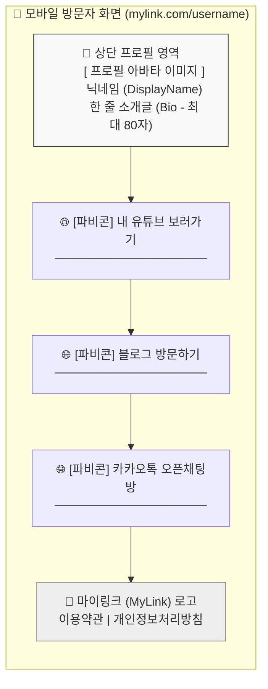
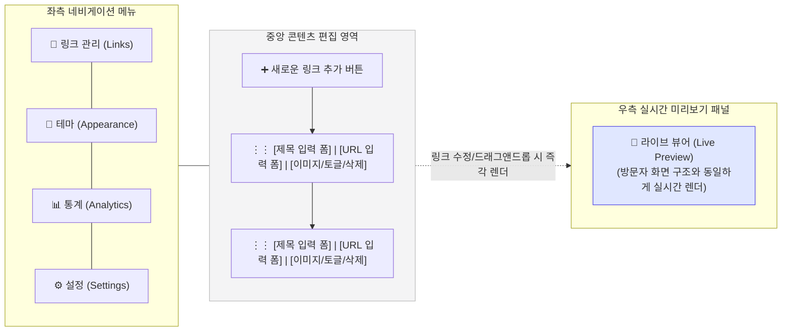
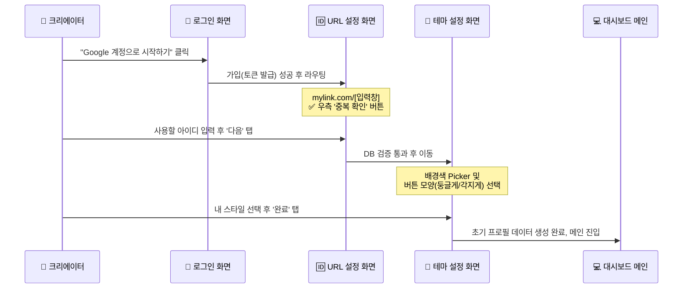

# 마이링크 (MyLink) UI 와이어프레임 및 화면 구조

본 문서는 마이링크의 핵심 화면 3가지(방문자 페이지, 소유자 대시보드, 가입 온보딩)의 구조를 요약한 와이어프레임입니다.

---

## 1. 방문자 페이지 화면 구조 (Mobile View)
인스타그램 등의 모바일 환경에서 띄워질 방문자 측면의 UI 설계입니다. 세로 스크롤 형태를 취합니다.

---

## 2. 프로필 소유자 - 관리자 대시보드 (Desktop View)
크리에이터가 링크 화면을 편집하고 실시간 렌더링을 확인하는 데스크톱 기반 대시보드 구조입니다. 좌측의 네비게이션과 중앙의 관리 영역, 우측의 실시간 미리보기(Live Preview)로 삼등분됩니다.

---

## 3. 회원가입 및 온보딩 흐름 (Onboarding Flow)
서비스를 처음 접하는 사용자의 가입부터 초기 프로필 셋업까지의 UI 흐름(Sequence)을 나타냅니다.

